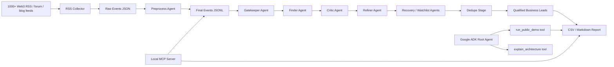

# Architecture



## Agent Roles

| Stage | Role |
| --- | --- |
| RSS Collector | Collects feed events, handles retries, GitHub fallback, Firecrawl fallback, and feed health reporting. |
| Preprocess Agent | Cleans event text, extracts entities and contact hints, and adds action-surface enrichment. |
| Gatekeeper Agent | Rejects noisy or non-actionable items unless there is evidence of an external business action path. |
| Finder Agent | Converts gated events into candidate business opportunities. |
| Critic Agent | Reviews candidate quality and flags weak evidence. |
| Refiner Agent | Rewrites retained leads with clearer evidence and outreach framing. |
| Recovery Agent | Re-checks promising dropped or near-miss items. |
| Filter Agent | Assigns chain, sector, and seeking categories. |
| Dedupe Stage | Consolidates opportunities from repeated runs and different time horizons. |
| ADK Root Agent | Exposes capstone tools for running the demo and explaining the system. |
| MCP Server | Exposes local sample events and report retrieval as MCP tools. |
| Agent Skill | Packages Web3 lead qualification rules for progressive disclosure. |

## Public Demo Mode

The public demo uses `data/sample/sample_events.jsonl` and a deterministic lead extractor in `src/demo_pipeline.py`.

It avoids:

- API keys.
- Database credentials.
- Private feeds.
- Paid services.

It still demonstrates the project flow:

1. Load Web3 events.
2. Detect action surfaces.
3. Suppress noisy events.
4. Score, filter, and dedupe leads.
5. Write a CSV and Markdown report.
6. Write a standalone HTML report for local/public review.

## MCP Server

The local MCP server is implemented in `src/mcp_server.py`.

Exposed tools:

- `list_sample_events`: returns bundled public sample events.
- `run_lead_demo`: runs the deterministic lead demo.
- `read_demo_report`: returns the generated Markdown report.

Verification completed:

- Server module imports successfully.
- Direct MCP tool functions return expected sample/demo data.
- `python src/mcp_server.py` launches and waits for MCP stdio messages.

## Agent Skill

The project includes an Agent Skill at `skills/web3-lead-qualification/SKILL.md`.

It captures:

- qualifying action surfaces,
- rejection rules,
- required lead fields,
- evidence requirements,
- confidence calibration,
- outreach wording.

This demonstrates the course idea of progressive disclosure: the skill teaches the agent how to qualify Web3 events without bloating the main ADK agent prompt.

## Deployability

The project uses reproducible local deployment rather than cloud hosting.

The deployment artifact is `data/output/demo_report.html`, generated by:

```powershell
python src/cli.py build-static-demo
```

This gives judges a browser-openable demo artifact while keeping the public path free of secrets, private databases, and paid services.

## Full Pipeline Mode

The adapted core scripts under `src/core_pipeline` preserve the original full pipeline. They now default to capstone-local paths:

- `config/Web3_rss_sources.json`
- `config/category_master.json`
- `config/filters_master.json`
- `data/raw`
- `data/processed`
- `data/output`

The full mode can be used for a richer demo after credentials are configured locally.
